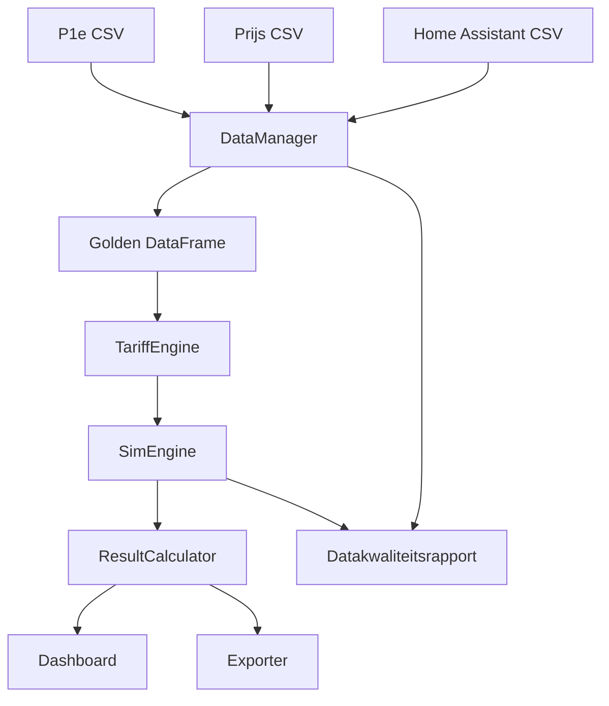

# DS-001 - Detailed Design: Thuisbatterij Simulator

**Document type:** Detailed Design  
**Project:** 023 Thuisbatterij  
**Versie:** 1.2  
**Datum:** 2026-04-27
**Auteur:** Gemini Code Assist / Codex  
**Gebaseerd op:** FD-001 v1.8 en URS-001 v1.6  
**Status:** Goedgekeurd - gereed voor implementatie

---

## 1. Doel en scope

Dit document beschrijft hoe de Thuisbatterij Simulator technisch wordt gebouwd. De DS vertaalt de goedgekeurde URS en FD naar implementeerbare modules, datacontracten, algoritmes en testpunten.

De tool simuleert kwartierdata voor 2024 en 2025 alsof de salderingsregeling in 2027 niet meer bestaat. De gebruiker kan hiermee batterijconfiguraties, bedrijfsmodi en batterijgroottes vergelijken.

V1 ondersteunt:
- historische P1e-, prijs- en Home Assistant-data uit `resources/`;
- drie bedrijfsmodi;
- maximaal vier handmatige configuraties;
- capaciteitssweep voor optimale batterijgrootte;
- financiele en technische KPI's;
- analyse-uitvoer en exports.

---

## 2. Architectuur

### 2.1 Modules

| Module | Bestand | Verantwoordelijkheid |
|---|---|---|
| `config` | `src/config.py` | Dataclasses, defaults, validatie van invoerparameters |
| `data_manager` | `src/data_manager.py` | Inlezen, normaliseren en valideren van brondata |
| `tariff_engine` | `src/tariff_engine.py` | Omzetten spotprijzen en tariefparameters naar koop-/verkoopprijzen |
| `sim_engine` | `src/sim_engine.py` | Stateful batterij-simulatie per interval en per bedrijfsmodus |
| `result_calculator` | `src/result_calculator.py` | KPI's, besparingsdecompositie, sweep en gevoeligheidsanalyse |
| `exporter` | `src/exporter.py` | CSV- en Excel-export |
| `dashboard` | `src/main.py` | Streamlit UI en orchestration |
| `validation` | `src/validation.py` | Data-, configuratie- en resultaatvalidatie |

### 2.2 Dataflow



### 2.3 Uitgangspunten

- Alle berekeningen draaien lokaal; geen externe services tijdens simulatie.
- De interne resolutie is 15 minuten.
- Alle energievelden zijn kWh per interval.
- Alle vermogensvelden zijn kW.
- Alle prijzen zijn euro per kWh.
- De DataFrame-index is timezone-aware Nederlandse tijd (`Europe/Amsterdam`) totdat export plaatsvindt.
- Brondata in `resources/` wordt nooit gewijzigd.

---

## 3. Datacontracten

### 3.1 Golden DataFrame

De `DataManager` levert een Golden DataFrame met een kwartierindex. Deze bevat nog geen batterij-effecten, maar wel de baseline voor alle simulaties.

| Kolom | Type | Eenheid | Omschrijving |
|---|---|---:|---|
| `timestamp_nl` | datetime | - | Nederlandse tijd, gelijk aan index voor export |
| `import_kwh` | float | kWh | Bruto import uit P1e, per interval |
| `export_kwh` | float | kWh | Bruto export uit P1e, per interval |
| `solar_kwh` | float | kWh | Zonne-opwek per interval |
| `demand_kwh` | float | kWh | Huishoudverbruik: `import_kwh - export_kwh + solar_kwh` |
| `netto_baseline_kwh` | float | kWh | `demand_kwh - solar_kwh`; positief = import, negatief = export |
| `import_zonder_batterij_kwh` | float | kWh | `max(netto_baseline_kwh, 0)` |
| `export_zonder_batterij_kwh` | float | kWh | `max(-netto_baseline_kwh, 0)` |
| `spot_price_eur_per_kwh` | float | EUR/kWh | Day-ahead spotprijs |
| `buy_price_eur_per_kwh` | float | EUR/kWh | All-in inkoopprijs |
| `sell_price_eur_per_kwh` | float | EUR/kWh | All-in terugleververgoeding |
| `data_quality_flags` | string/list | - | Meldingen voor datakwaliteit |

### 3.2 Simulatieresultaat per configuratie

Elke simulatie levert een kopie van het Golden DataFrame plus onderstaande kolommen.

| Kolom | Type | Eenheid | Omschrijving |
|---|---|---:|---|
| `soc_kwh` | float | kWh | State of Charge aan einde interval |
| `soc_pct` | float | % | SoC als percentage van effectieve capaciteit |
| `laad_kwh` | float | kWh | Totale energie richting batterij in dit interval |
| `ontlaad_kwh` | float | kWh | Totale energie uit batterij voor rendementverlies |
| `laad_uit_solar_kwh` | float | kWh | Deel van lading uit zonne-overschot |
| `laad_uit_net_kwh` | float | kWh | Deel van lading uit net |
| `ontlaad_naar_huis_kwh` | float | kWh | Batterij-energie gebruikt voor huishoudvraag |
| `ontlaad_naar_net_kwh` | float | kWh | Batterij-energie geexporteerd naar net |
| `round_trip_loss_kwh` | float | kWh | Verlies door laad-/ontlaadrendement |
| `import_met_batterij_kwh` | float | kWh | Import na batterij |
| `export_met_batterij_kwh` | float | kWh | Export na batterij |
| `batterij_export_kwh` | float | kWh | Alias/rapportageveld voor `ontlaad_naar_net_kwh` |
| `netladen_kwh` | float | kWh | Alias/rapportageveld voor `laad_uit_net_kwh` |
| `kosten_zonder_batterij_eur` | float | EUR | Intervalkosten baseline |
| `kosten_met_batterij_eur` | float | EUR | Intervalkosten met batterij |
| `besparing_interval_eur` | float | EUR | Baseline minus batterijscenario |
| `actie` | category/string | - | `idle`, `solar_charge`, `grid_charge`, `discharge_home`, `discharge_export`, `mixed` |

### 3.3 Configuratie-objecten

Gebruik Python dataclasses of Pydantic-modellen. Namen bevatten eenheden.

| Config | Belangrijke velden |
|---|---|
| `TariffConfig` | `energy_tax_eur_per_kwh`, `vat_pct`, `supplier_markup_buy_eur_per_kwh`, `supplier_markup_sell_eur_per_kwh`, `fixed_costs_eur_per_year`, `indexation_pct_per_year`, `discount_rate_pct` |
| `BatteryConfig` | `capacity_kwh`, `charge_power_kw`, `discharge_power_kw`, `charge_efficiency_pct`, `discharge_efficiency_pct`, `min_soc_pct`, `max_soc_pct`, `start_soc_pct`, `lifetime_years`, `degradation_pct_per_100_cycles`, `purchase_price_eur` |
| `ModeConfig` | `mode`, `min_margin_eur_per_kwh`, `threshold_low_eur_per_kwh`, `threshold_high_eur_per_kwh`, `percentile_low`, `percentile_high`, `decision_rule` |
| `SweepConfig` | `enabled`, `capacity_min_kwh`, `capacity_max_kwh`, `capacity_step_kwh`, `power_scaling_mode`, `c_rate`, `fixed_charge_power_kw`, `fixed_discharge_power_kw`, `price_model` |

---

## 4. DataManager

### 4.1 P1e-verwerking

P1e-data bevat cumulatieve meterstanden. De volgorde is verplicht:

1. Lees ruwe P1e-CSV en parse timestamps als `Europe/Amsterdam`.
2. Sorteer op timestamp en oorspronkelijke rijvolgorde.
3. Bereken cumulatieve import/export:
   - `import_total_kwh = import_t1_kwh + import_t2_kwh`
   - `export_total_kwh = export_t1_kwh + export_t2_kwh`
4. Bereken differenties per ruwe rij:
   - `import_kwh = import_total_kwh.diff()`
   - `export_kwh = export_total_kwh.diff()`
5. Verwijder of markeer de eerste rij per bestand als `no_previous_reading`.
6. Negatieve differenties worden gemarkeerd als datakwaliteitsfout. Ze worden niet stilzwijgend gecorrigeerd.
7. Pas daarna worden dubbele lokale timestamps bij DST-najaar geaggregeerd door intervalwaarden te sommeren.

Belangrijk: cumulatieve meterstanden mogen nooit met `groupby(level=0).sum()` worden gesommeerd. Alleen reeds berekende interval-differenties mogen worden geaggregeerd.

### 4.2 DST-afhandeling

| Situatie | Afhandeling |
|---|---|
| Voorjaar-DST | 02:00-02:45 ontbreekt; dag heeft 92 intervallen; melden in datakwaliteitsrapport |
| Najaar-DST | Dubbele lokale timestamps in P1e; eerst differenties berekenen, daarna intervalwaarden sommeren |
| Prijsdata | Join op Nederlandse intervaltijd; missende prijzen krijgen kosten 0 en een kwaliteitsmelding conform FD FR-08 |

### 4.3 Solar-verwerking

Home Assistant-data wordt vertaald naar interval-opwek:

1. Preferente bron is cumulatieve `energieopbrengst_levenslang`.
2. Bereken uur- of sensor-differenties en verdeel naar kwartieren met energiebehoud.
3. `uitgangsvermogen` wordt gebruikt als sanity check wanneer beschikbaar.
4. Perioden zonder betrouwbare opwekbron krijgen `solar_kwh = 0` en een melding, conform URS A-09.

Voor uurwaarden geldt:

```python
solar_15min_kwh = solar_hourly_kwh.resample("15min").ffill() / 4
```

### 4.4 Energiebalansvalidatie

De DataManager berekent:

```python
demand_kwh = import_kwh - export_kwh + solar_kwh
netto_baseline_kwh = demand_kwh - solar_kwh
```

De verificatie vergelijkt totale import en export met de P1e-meterstanden. Elke grootheid moet binnen de UR-17-tolerantie vallen, anders blokkeert of waarschuwt de tool volgens de ernst.

---

## 5. TariffEngine

### 5.1 Prijsvelden

De TariffEngine voegt `buy_price_eur_per_kwh` en `sell_price_eur_per_kwh` toe aan het Golden DataFrame.

De exacte tariefformules volgen FD-001. In de implementatie moeten vaste jaarkosten apart worden gehouden van intervalkosten, omdat vaste kosten de absolute jaarkosten beinvloeden maar niet de batterijbesparing per interval.

### 5.2 Intervalkosten

Baseline:

```python
kosten_zonder_batterij_eur =
    import_zonder_batterij_kwh * buy_price_eur_per_kwh
    - export_zonder_batterij_kwh * sell_price_eur_per_kwh
```

Met batterij:

```python
kosten_met_batterij_eur =
    import_met_batterij_kwh * buy_price_eur_per_kwh
    - export_met_batterij_kwh * sell_price_eur_per_kwh
```

Besparing:

```python
besparing_interval_eur = kosten_zonder_batterij_eur - kosten_met_batterij_eur
```

---

## 6. SimEngine

### 6.1 Algemene stateful batterijregel

Alle modi gebruiken een sequentiele interval-loop. Vectorisatie mag worden gebruikt voor voorberekende maskers en look-ahead velden, maar niet voor de uiteindelijke SoC-mutatie.

Per interval gelden:

- `soc_kwh` wordt begrensd tussen `min_soc_kwh` en `max_soc_kwh`.
- `charge_limit_kwh = charge_power_kw * 0.25`.
- `discharge_limit_kwh = discharge_power_kw * 0.25`.
- Energie naar de batterij wordt begrensd door resterende opslagruimte.
- Energie uit de batterij wordt begrensd door beschikbare energie boven `min_soc_kwh`.
- In elk interval is netladen en ontladen wederzijds uitsluitend.
- Zonne-overschot laden heeft prioriteit boven netladen.

### 6.2 Rendement

Laadrendement en ontlaadrendement worden apart toegepast:

```python
soc_increase_kwh = energy_to_battery_input_kwh * charge_efficiency
usable_output_kwh = energy_from_soc_kwh * discharge_efficiency
loss_kwh = energy_to_battery_input_kwh - soc_increase_kwh
loss_kwh += energy_from_soc_kwh - usable_output_kwh
```

Voor economische vergelijkingen met round-trip rendement:

```python
round_trip_efficiency = charge_efficiency * discharge_efficiency
```

### 6.3 Jaarovergangen en degradatie

De simulatie loopt per kalenderjaar:

- Begin-SoC bij aanvang van elk simulatiejaar is 0 kWh, tenzij de gebruiker later expliciet anders configureert.
- De effectieve capaciteit wordt bij de start van elk jaar bepaald op basis van degradatie uit eerdere jaren.
- Degradatie loopt door van 2024 naar 2025; SoC niet.

Capaciteitsverlies per jaar:

```python
equivalent_full_cycles = total_discharge_from_soc_kwh / nominal_capacity_kwh
loss_kwh = (
    equivalent_full_cycles
    * (degradation_pct_per_100_cycles / 100)
    * nominal_capacity_kwh
    / 100
)
```

Als effectieve capaciteit kleiner of gelijk aan 0 wordt, is de batterij buiten gebruik voor resterende jaren.

### 6.4 Modus 1 - Zelfconsumptie / nul-op-de-meter

Bronnen:
- zonne-overschot.

Sinks:
- huishoudvraag.

Niet toegestaan:
- netladen;
- batterij-export naar het net.

Intervalvolgorde:

1. Bereken `netto_baseline_kwh`.
2. Als `netto_baseline_kwh < 0`: laad uit solar met maximaal het zonne-overschot, laadvermogen en opslagruimte.
3. Als `netto_baseline_kwh > 0`: ontlaad naar huis met maximaal huishoudvraag, ontlaadvermogen en beschikbare SoC.
4. Restant wordt import of solar-export.

### 6.5 Slimme modus - Slim laden voor eigen verbruik

Bronnen:
- zonne-overschot;
- net bij economisch voordeel.

Sinks:
- huishoudvraag.

Niet toegestaan:
- batterij-export naar het net.

Look-ahead:

Voor elk interval wordt de hoogste toekomstige vermijdingsprijs bepaald binnen het toegestane publicatievenster:
- vóór 13:00: resterende intervallen van dezelfde kalenderdag;
- vanaf 13:00: de komende 24 uur.

De implementatie gebruikt twee gevectoriseerde reeksen:

```python
candidate_price = buy_price_eur_per_kwh.where(netto_baseline_kwh > 0)
same_day_future = candidate_price.groupby(index.normalize()).transform(...)
next_24h_future = reverse_rolling_max(candidate_price, horizon=96)
future_max_avoid_price = where(after_13_00, next_24h_future, same_day_future)
```

Laadconditie voor netladen:

```python
future_max_avoid_price >= buy_price_eur_per_kwh * max(
    1 / round_trip_efficiency,
    1 + min_price_spread_pct / 100,
)
```

Aanvullend geldt:
- er moet een toekomstig tekort bestaan vóór de volgende betekenisvolle zonne-laadkans;
- het huidige interval mag niet duurder zijn dan een later koopmoment binnen hetzelfde publicatievenster.

Intervalvolgorde:

1. Laad zonne-overschot zoals Modus 1.
2. Als er geen zonne-laadactie is en de laadconditie waar is: laad uit net.
3. Als de laadconditie niet waar is en er huishoudvraag is: ontlaad naar huis.
4. Restant wordt import of solar-export.

Netladen en ontladen mogen in hetzelfde interval niet allebei plaatsvinden.

---

## 7. ResultCalculator

### 7.1 Financiele KPI's

Per configuratie:

- totale kosten zonder batterij;
- totale kosten met batterij;
- jaarlijkse besparing;
- aanschafprijs;
- eenvoudige terugverdientijd;
- NCW over levensduur;
- break-even aanschafprijs;
- verschil tussen scenariojaren 2024 en 2025.

### 7.2 Technische KPI's

Per configuratie:

- zelfverbruik;
- zelfvoorzienendheid;
- totale import;
- totale export;
- netladen;
- batterij-export;
- geladen en ontladen energie;
- round-trip verlies;
- equivalente vollaadcycli;
- gemiddelde en maximale SoC;
- capaciteitsverlies door degradatie.

### 7.3 Besparingsdecompositie

De decompositie rapporteert minimaal:

| Component | Definitie |
|---|---|
| Opslag zonne-overschot | Waarde van minder export en minder latere import door solar-lading |
| Slim laden | Waarde van netladen op laag tarief en later import vermijden |
| Batterij-export | Opbrengst uit export van batterij-energie |
| Round-trip verlies | Negatieve bijdrage door energieverlies |
| Degradatie-effect | Verschil door lagere effectieve capaciteit in volgende jaren |

De exacte decompositie hoeft niet exact op te tellen tot de totale besparing als interacties tussen componenten bestaan. In dat geval toont de tool ook een restpost `interactie_effect_eur`.

### 7.4 Capaciteitssweep

De sweep voert dezelfde simulatie uit voor elk capaciteitspunt.

Aantal punten:

```python
n_points = floor((capacity_max_kwh - capacity_min_kwh) / capacity_step_kwh) + 1
```

Validatie:

- `n_points <= 200`;
- `capacity_min_kwh > 0`;
- `capacity_max_kwh >= capacity_min_kwh`;
- `capacity_step_kwh > 0`.

Per punt:

- effectieve capaciteit wordt afgeleid uit het sweeppunt;
- vermogen schaalt via C-rate of blijft vast volgens configuratie;
- aanschafprijs komt uit lineair model of handmatige tabel;
- alle KPI's worden berekend.

Marginale meeropbrengst:

```python
marginal_saving_eur_per_kwh =
    (saving_next_eur - saving_current_eur) / capacity_step_kwh
```

Optimumcriteria:

- hoogste NCW;
- kortste terugverdientijd;
- hoogste jaarlijkse besparing;
- eerste capaciteit waarbij marginale meeropbrengst onder gebruikersdrempel valt.

### 7.5 Gevoeligheidsanalyse

Voor een gekozen configuratie of aanbevolen sweep-capaciteit worden beperkte varianten doorgerekend:

- batterijprijs: -25%, basis, +25%;
- energieprijsniveau: -25%, basis, +25%;
- rendement: -5 procentpunt, basis, +5 procentpunt;
- terugleververgoeding: -25%, basis, +25%;
- minimale marge: basis, basis + 0,02 EUR/kWh.

---

## 8. Dashboard

### 8.1 Schermen

| Scherm | Inhoud |
|---|---|
| Datastatus | Bestanden, datakwaliteit, DST-meldingen, ontbrekende prijzen |
| Configuratie | Tarieven, batterijconfiguraties, bedrijfsmodus, sweep |
| Resultaten | KPI-kaarten, grafieken, vergelijking configuraties |
| Analyse | Decompositie, batterijbenutting, maandanalyse, gevoeligheid |
| Export | CSV/Excel downloads |

### 8.2 UI-regels

- Streamlit is de applicatieschil.
- Plotly wordt gebruikt voor interactieve grafieken.
- Dark mode is standaard, met toggle.
- Configuratiekleuren volgen FD-001.
- Modusafhankelijke velden verschijnen alleen wanneer relevant.
- Foutmeldingen blokkeren de simulatie als de invoer niet betrouwbaar is.

---

## 9. Exporter

### 9.1 CSV per configuratie

Bevat per kwartier minimaal:

`timestamp_nl`, `solar_kwh`, `demand_kwh`, `import_zonder_batterij_kwh`,
`export_zonder_batterij_kwh`, `soc_kwh`, `soc_pct`, `laad_kwh`,
`ontlaad_kwh`, `laad_uit_solar_kwh`, `laad_uit_net_kwh`,
`ontlaad_naar_huis_kwh`, `ontlaad_naar_net_kwh`, `round_trip_loss_kwh`,
`import_met_batterij_kwh`, `export_met_batterij_kwh`,
`spot_price_eur_per_kwh`, `buy_price_eur_per_kwh`, `sell_price_eur_per_kwh`,
`kosten_zonder_batterij_eur`, `kosten_met_batterij_eur`,
`besparing_interval_eur`, `actie`.

### 9.2 KPI-export

Bevat per configuratie alle financiele en technische KPI's plus gebruikte configuratieparameters.

### 9.3 Sweep-export

CSV en Excel bevatten per capaciteitspunt:

- capaciteit;
- laad-/ontlaadvermogen;
- aanschafprijs;
- bedrijfsmodus;
- KPI's;
- marginale meeropbrengst;
- indicator of dit punt aanbevolen is voor het gekozen criterium.

### 9.4 Analyse-export

Excel bevat tabbladen:

- `KPI`;
- `Besparingsdecompositie`;
- `Maand analyse`;
- `Gevoeligheid`;
- `Sweep` indien actief;
- `Configuratie`.

---

## 10. Validatie en foutafhandeling

| Code | Situatie | Gedrag |
|---|---|---|
| `VAL-001` | Verplicht bestand ontbreekt | Simulatie blokkeren |
| `VAL-002` | Negatieve P1e-differentie | Blokkeren of expliciet laten uitsluiten door gebruiker |
| `VAL-003` | Prijs ontbreekt | Intervalkosten op 0, melding conform FD FR-08 |
| `VAL-004` | Batterijcapaciteit ongeldig | Simulatie blokkeren |
| `VAL-005` | Min SoC >= Max SoC | Simulatie blokkeren |
| `VAL-006` | Rendement buiten 0-100% | Simulatie blokkeren |
| `VAL-007` | Modus 3 lage drempel >= hoge drempel | Simulatie blokkeren |
| `VAL-008` | Sweep > 200 punten | Simulatie blokkeren |
| `VAL-009` | Handmatige sweep-prijstabel heeft verkeerde lengte | Simulatie blokkeren |

---

## 11. Runtime en packaging

### 11.1 `start.bat`

De launcher:

1. controleert Python 3.11+;
2. maakt `venv` aan als deze ontbreekt;
3. activeert altijd de venv;
4. voert altijd `python -m pip install -r requirements.txt` uit na activatie;
5. start Streamlit met `streamlit run src/main.py`;
6. toont een duidelijke foutmelding als een stap faalt;
7. gebruikt `pause` alleen bij fouten, zodat een succesvolle start niet onnodig blokkeert.

Concept:

```batch
@echo off
python --version >nul 2>&1
if %errorlevel% neq 0 (
    echo Python niet gevonden. Installeer Python 3.11 of hoger.
    pause
    exit /b 1
)

if not exist "venv" (
    python -m venv venv
    if %errorlevel% neq 0 (
        echo Venv aanmaken mislukt.
        pause
        exit /b 1
    )
)

call venv\Scripts\activate
python -m pip install -r requirements.txt
if %errorlevel% neq 0 (
    echo Requirements installeren mislukt.
    pause
    exit /b 1
)

streamlit run src/main.py
if %errorlevel% neq 0 (
    echo Streamlit starten mislukt.
    pause
    exit /b 1
)
```

### 11.2 Dependencies

Minimale dependencies:

- Python 3.11+;
- pandas >= 2.0;
- numpy >= 1.24;
- streamlit >= 1.30;
- plotly >= 5.18;
- openpyxl of xlsxwriter voor Excel-export;
- pytest voor tests.

Numba is optioneel. De eerste implementatie mag pure Python/NumPy gebruiken zolang de sweep met maximaal 200 punten acceptabel presteert.

---

## 12. Teststrategie

### 12.1 Unit tests

| Testgebied | Voorbeelden |
|---|---|
| P1e-differenties | Cumulatieve T1/T2 naar interval-kWh, negatieve diff detectie |
| DST | Voorjaar 92 intervallen, najaar dubbele timestamps na diff sommeren |
| Solar | Energiebehoud bij uur-naar-kwartier verdeling |
| Tarieven | Koop-/verkoopprijs en intervalkosten |
| SimEngine modus 1 | Geen netladen, geen batterij-export, SoC-grenzen |
| SimEngine slimme modus | Netladen alleen bij economische conditie, geen export, geen laden en ontladen tegelijk, 13:00-publicatieregel |
| Degradatie | 2% per 100 cycli resulteert in correcte capaciteitsdaling |
| Sweep | Puntentelling, C-rate, marginale meeropbrengst, max 200 punten |
| Export | Vereiste kolommen aanwezig |

### 12.2 Integratietests

- Volledige run voor 2024.
- Volledige run voor 2025.
- Gecombineerde run 2024 en 2025 met degradatie-doorloop en SoC-reset per jaar.
- Vier handmatige configuraties.
- Sweep met minimaal, gemiddeld en maximaal aantal punten.

### 12.3 Acceptatiecriteria uit URS/FD

De implementatie is pas gereed voor acceptatietest als:

- UR-01 t/m UR-21 traceerbaar zijn naar code en tests;
- datakwaliteitsrapport de bekende inputproblemen meldt;
- exports zelfstandig interpreteerbaar zijn;
- KPI's reproduceerbaar zijn vanuit dezelfde configuratie;
- geen simulatiepad brondata in `resources/` wijzigt.

---

## 13. Traceerbaarheid

### 13.1 URS naar DS

| URS | DS-sectie |
|---|---|
| UR-01 | §4 |
| UR-02 | §5 |
| UR-03 | §3.3, §6.1, §6.2, §6.3 |
| UR-04 | §6.4, §6.5, §6.6 |
| UR-05 | §4.2 |
| UR-06 | §3.2, §6 |
| UR-07 | §8 |
| UR-08 | §6.3, §12.2 |
| UR-09 | §7.1 |
| UR-10 | §7.2 |
| UR-11 | §8 |
| UR-12 | §9 |
| UR-13 | §2.3, §11 |
| UR-14 | §11 |
| UR-15 | §8 |
| UR-16 | §4, §10 |
| UR-17 | §4.4, §12 |
| UR-18 | §3.3, §9 |
| UR-19 | §3.2, §9 |
| UR-20 | §7.4 |
| UR-21 | §7.3, §7.5, §9.4 |

### 13.2 FD naar DS

| FD-onderdeel | DS-sectie | Dekking |
|---|---|---|
| FD §1 Architectuur en modules | §2 | Modulegrenzen, dataflow en lokale runtime |
| FD §3.1 Data-inleeslogica | §4 | P1e-differenties, DST, solar-verwerking en energiebalansvalidatie |
| FD §3.2 Tariefmodel | §5 | Koop-/verkoopprijs, baselinekosten en kosten met batterij |
| FD §3.3 Batterijconfiguratie en bedrijfsmodi | §3.3, §6 | Configuratie-objecten, SoC-regels, rendement, degradatie en Modus 1/2/3 |
| FD §3.3 Capaciteitssweep | §7.4 | Sweeppunten, C-rate/vermogensschaling, prijsmodel, marginale meeropbrengst en optimumcriteria |
| FD §3.4 Resultaten en KPI's | §7.1, §7.2 | Financiele en technische KPI's |
| FD §3.4 Analyse- en beslisondersteuning | §7.3, §7.5 | Besparingsdecompositie, batterijbenutting, gevoeligheidsanalyse en break-even ondersteuning |
| FD §3.5 Dashboard/UI | §8 | Schermen, modusafhankelijke invoer, grafieken en datastatus |
| FD §3.6 Export | §9 | CSV per configuratie, KPI-export, sweep-export en analyse-export |
| FD §5 Foutafhandeling en validatie | §10 | Blokkerende validaties, waarschuwingen en foutcodes |
| FD §5/§3.5 Opstartlauncher | §11 | `start.bat`, venv, requirements-installatie en Streamlit-start |
| FD §6 Traceerbaarheid | §13 | URS- en FD-traceerbaarheid naar DS |
| FD reviewhistorie v1.5-v1.8 | §4, §6, §11, §14 | Verwerking van solar-energiebehoud, Modus 2/3-regels, degradatie en runtimepunten |

---

## 14. Reviewhistorie

| Reviewdatum | Reviewer | Bevinding | Verwerkt in | Actie |
|---|---|---|---|---|
| 2026-04-27 | Codex | ISSUE(ds): Formele DS-review was V-model-technisch geblokkeerd zolang URS-001 en FD-001 status `Concept` hadden. | v1.2 | Gesloten: URS-001 v1.6 en FD-001 v1.8 zijn door Rens goedgekeurd |
| 2026-04-27 | Codex | REVIEW(codex): DST-najaar mocht niet via `df.groupby(level=0).sum()` op cumulatieve P1e-meterstanden gebeuren. | v1.2 | Gesloten: differenties eerst, daarna dubbele intervallen sommeren |
| 2026-04-27 | Codex | REVIEW(codex): Golden DataFrame miste velden voor export en analyse. | v1.2 | Gesloten: schema uitgebreid met baseline-, simulatie-, kosten- en analysevelden |
| 2026-04-27 | Codex | REVIEW(codex): Modus 2 look-ahead moest reverse cumulative maximum gebruiken. | v1.2 | Gesloten: look-ahead formule opgenomen |
| 2026-04-27 | Codex | REVIEW(codex): Modus 1 en 3 waren te sterk als vectorized beschreven terwijl SoC stateful is. | v1.2 | Gesloten: alle modi gebruiken sequentiele SoC-loop |
| 2026-04-27 | Codex | REVIEW(codex): Modus 3 moest FD v1.8 margeformule gebruiken. | v1.2 | Gesloten: formule expliciet opgenomen |
| 2026-04-27 | Codex | REVIEW(codex): Degradatieformule gebruikte percentage-eenheid foutgevoelig. | v1.2 | Gesloten: formule conform FD opgenomen |
| 2026-04-27 | Codex | REVIEW(codex): Eind-SoC 2024 mocht niet als begin-SoC 2025 worden gebruikt. | v1.2 | Gesloten: SoC reset per jaar, degradatie loopt door |
| 2026-04-27 | Codex | REVIEW(codex): `start.bat` installeerde requirements alleen bij nieuwe venv. | v1.2 | Gesloten: requirements worden altijd na activatie geinstalleerd |
| 2026-04-27 | Gemini | REVIEW(gemini): Solar-interpolatie moet energiebehoud garanderen. | v1.2 | Gesloten: step-down verdeling met `waarde / 4` vastgelegd in §4.3 |
| 2026-04-27 | Gemini | REVIEW(gemini): Degradatie moet duidelijk per jaar of tijdens het jaar worden toegepast. | v1.2 | Gesloten: degradatie wordt tussen jaren toegepast; SoC reset per jaar in §6.3 |
| 2026-04-27 | Gemini | REVIEW(gemini): `start.bat` moet een venv aanmaken of activeren. | v1.2 | Gesloten: venv-flow opgenomen in §11.1 |
| 2026-04-27 | Gemini | REVIEW(gemini): Modus 3 heeft minimale marge nodig om cycle churn te voorkomen. | v1.2 | Gesloten: Modus 3 margeformule opgenomen in §6.6 |
| 2026-04-27 | Codex | REVIEW(codex): DS-traceerbaarheid verwees alleen naar URS en niet naar FD. | v1.2 | Gesloten: FD naar DS traceerbaarheid toegevoegd in §13.2 |
| 2026-04-27 | Gemini | REVIEW(gemini): DS-001 v1.2 is gereed voor implementatie. Kleine observaties: Modus 3 `expected_export_revenue_eur_per_kwh` (percentiel) kan explicieter verwijzen naar FD, `start.bat` pause commando kan conditioneel. | v1.2 | Gesloten: percentieldefinitie verduidelijkt in §6.6; `pause` alleen bij fouten in §11.1 |

---

## 15. Goedkeuring

| Rol | Naam | Datum | Status |
|---|---|---|---|
| Opdrachtgever / Gebruiker | Rens Roosloot | 2026-04-27 | Goedgekeurd (v1.2) |
| Functioneel ontwerp | Claude Code | | Goedgekeurd |
| Technisch ontwerp | Codex | 2026-04-27 | Goedgekeurd (v1.2) |
